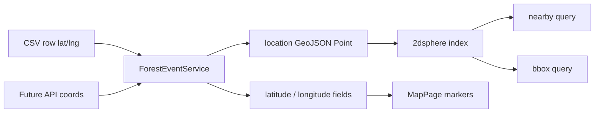
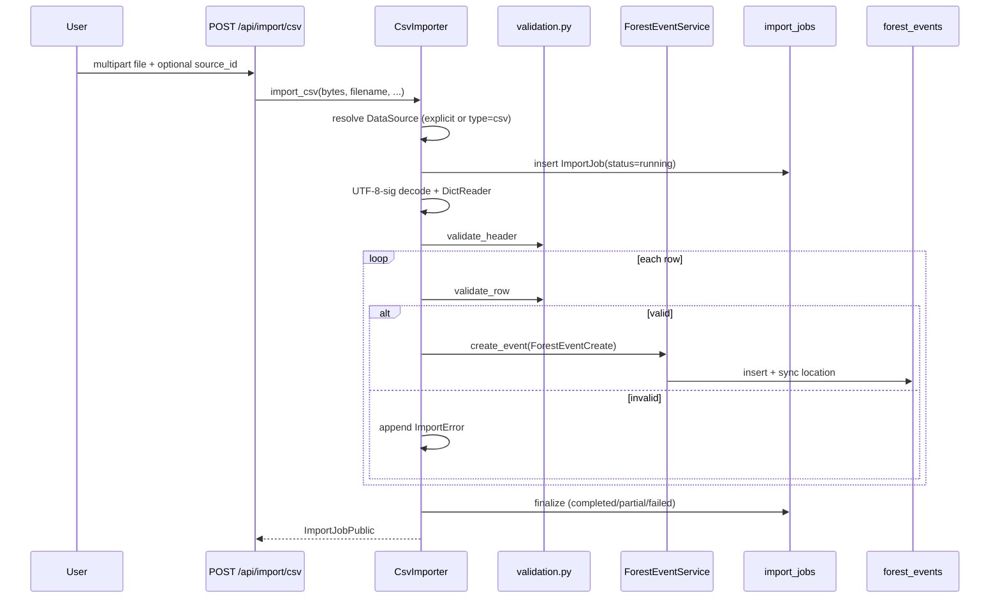
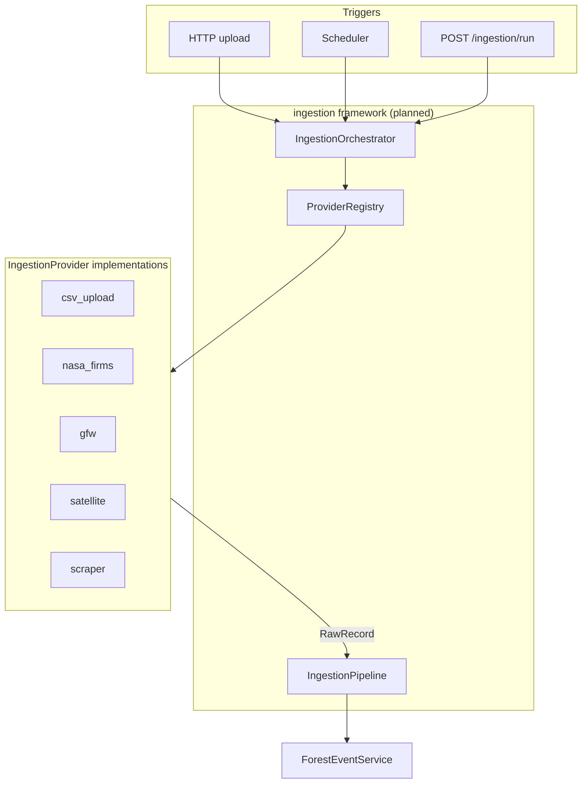

# ForestWatch — Architecture

**Last updated:** 2026-06-10  
**API version:** 0.3.0

---

## 1. System overview

ForestWatch monitors forest disturbance events. The backend is a **layered FastAPI application** over MongoDB. The frontend is a **React SPA** that authenticates via httpOnly cookies and consumes REST APIs.

```mermaid
flowchart TB
    subgraph Client
        FE[React SPA]
    end

    subgraph API["FastAPI — server.py"]
        AUTH[/api/auth]
        EVENTS[/api/events]
        ALERTS[/api/alerts legacy]
        DS[/api/data-sources]
        IMPORT[/api/import]
        ANALYTICS[/api/analytics]
        MODULES[/api/modules]
    end

    subgraph Domain
        FES[ForestEventService]
        DSS[DataSourceService]
        AUTH_SVC[AuthService]
    end

    subgraph Modules
        ING[ingestion — CsvImporter]
        ANA[analytics — repo + service]
    end

    subgraph MongoDB
        users[(users)]
        fe[(forest_events)]
        ds[(data_sources)]
        ij[(import_jobs)]
        notif[(notifications)]
    end

    FE --> API
    IMPORT --> ING --> FES
    ANALYTICS --> ANA --> fe
    EVENTS --> FES --> fe
    ALERTS --> FES
    DS --> DSS --> ds
    AUTH --> AUTH_SVC --> users
    FES --> ds
    ING --> ij
```

**Canonical rule:** All disturbance data flows into `forest_events` through `ForestEventService.create_event()`. Analytics and legacy alerts **read** from that collection only.

---

## 2. Layered backend structure

```
backend/
├── server.py                 # App composition, startup hooks, router mounting
└── app/
    ├── core/                 # config, database, security, errors, logging, migrations
    ├── models/               # Pydantic domain documents + DTOs
    ├── repositories/         # MongoDB access (one collection per repo)
    ├── services/             # Business logic (auth, events, data sources, alerts, notifications)
    ├── api/                  # FastAPI routers + deps.py
    └── modules/              # Feature packages (ingestion, analytics, placeholders)
```

| Layer | Responsibility | Example |
|-------|----------------|---------|
| **api** | HTTP, auth deps, request parsing | `import_routes.py` |
| **services** | Domain rules, orchestration | `ForestEventService` |
| **repositories** | CRUD, queries, aggregations | `ForestEventRepository` |
| **models** | Types, validation, mongo serialization | `ForestEvent`, `ImportJob` |
| **core** | Cross-cutting infrastructure | `get_settings()`, `AppError` |
| **modules** | Optional feature verticals | `CsvImporter`, `AnalyticsRepository` |

**Dependency injection:** `app/api/deps.py` wires repositories and services into route handlers via FastAPI `Depends()`.

---

## 3. Domain model

### 3.1 ForestEvent (canonical)

The central entity. Stored in `forest_events`.

| Field | Type | Notes |
|-------|------|-------|
| `title`, `country`, `region` | string | Human labels |
| `latitude`, `longitude` | float | Client-friendly flat coords |
| `location` | GeoJSON Point | `[lng, lat]` — indexed 2dsphere |
| `event_type` | enum | 7-value taxonomy |
| `severity` | enum | low → critical |
| `affected_area_ha` | float | Hectares |
| `confidence` | float | 0–1 |
| `source_id` | string | FK → `data_sources._id` |
| `detected_at` | UTC datetime | BSON datetime |
| `status` | enum | open / investigating / resolved |
| `metadata` | dict | Import provenance, external IDs |

### 3.2 DataSource

Registry of event producers (`data_sources` collection). Seeded demo entries cover satellite, CSV, API, scraper, and manual types. Ingestion resolves `source_id` from this catalog.

### 3.3 ImportJob

Audit record per ingestion run (`import_jobs` collection). Tracks `status`, row counts, per-row errors, duration. Used by CSV today; intended reuse for FIRMS and future providers.

### 3.4 User & Notification

- `users` — email/password auth
- `notifications` — references `forest_event_id`; dispatch not implemented

---

## 4. API surface (current)

| Prefix | Purpose | Auth |
|--------|---------|------|
| `/api/auth` | register, login, logout, refresh, me | Mixed |
| `/api/events` | Canonical CRUD + geo + time queries | Required |
| `/api/alerts` | Legacy list + stats for dashboard/map | Required |
| `/api/data-sources` | Source registry CRUD | Required (except `/types`) |
| `/api/notifications` | List + mark read | Required |
| `/api/import` | CSV upload + job status | Required |
| `/api/analytics` | Aggregations | Required |
| `/api/modules` | Capability registry | Public |

---

## 5. Geospatial implementation

### 5.1 Model (`app/models/geo.py`)

- `GeoJSONPoint` — RFC 7946 Point, coordinates `[longitude, latitude]`
- `bbox_polygon()` — closed ring for bounding-box queries
- `ForestEventService._sync_location()` sets `location` from lat/lng on every create/update

### 5.2 Index

```python
# server.py startup
await db.forest_events.create_index([("location", "2dsphere")])
```

### 5.3 Queries (`ForestEventRepository`)

| Endpoint | Mongo operator | Sort |
|----------|----------------|------|
| `GET /events/nearby` | `$nearSphere` + `$maxDistance` (meters) | Distance ASC |
| `GET /events/bbox` | `$geoWithin` on polygon | `detected_at` DESC |

### 5.4 Migration

`backfill_geojson_location()` runs at startup — idempotent backfill for events missing `location`.

### 5.5 Frontend

`MapPage.jsx` uses **flat** `location.lat` / `location.lng` from the legacy alerts API, not GeoJSON directly. Backend maintains both shapes.



---

## 6. Analytics implementation

### 6.1 Architecture

```
GET /api/analytics/*
    → analytics_routes.py
    → AnalyticsService (shape + validate params)
    → AnalyticsRepository (MongoDB aggregation only)
    → forest_events collection
```

**No cache, no ML, no write path.** New events (seed, CSV, future imports) appear in aggregations immediately.

### 6.2 Repository pipelines (`analytics_repository.py`)

| Method | Pipeline |
|--------|----------|
| `overview()` | `$group` all docs → counts, `$sum` area, `$avg` confidence, status `$cond` sums |
| `by_country()` | `$group` by `$country`, sort `event_count` DESC |
| `by_event_type()` | `$group` by `$event_type` |
| `by_severity()` | `$group` by `$severity` |
| `trends(start, end, interval)` | `$match` on `detected_at`, `$group` with `$dateTrunc` (UTC) |

### 6.3 Service shaping (`analytics_service.py`)

- Rounds floats via `_r()`
- **Zero-fills** full `EVENT_TYPES` taxonomy (7 entries) for stable chart axes
- **Zero-fills** severity dict in canonical order: low → critical
- Trends: default range last 30 days; validates `interval` and `start ≤ end`

### 6.4 Circular import avoidance

`analytics/__init__.py` does **not** import `analytics_routes`. `server.py` imports the router directly:

```python
from app.modules.analytics.analytics_routes import router as analytics_router
```

### 6.5 Frontend gap

Dashboard uses `GET /api/alerts/stats` (legacy `ForestEventRepository.stats()`), **not** `/api/analytics/*`. Both read the same underlying data with different response shapes.

---

## 7. CSV ingestion flow (implemented)

### 7.1 Sequence



### 7.2 Validation rules (`validation.py`)

**Required columns:** title, country, region, latitude, longitude, event_type, severity, affected_area_ha  
**Optional:** confidence (0–1), detected_at (ISO 8601)

### 7.3 Limits

- Max file size: 5 MB
- Max rows per run: 10,000
- Synchronous (blocks HTTP request)

### 7.4 Provenance metadata

```json
{
  "imported_from": "upload.csv",
  "import_job_id": "<ObjectId>"
}
```

### 7.5 Analytics downstream

Imported events are standard `forest_events` documents → included in all analytics aggregations and map/dashboard via legacy alerts adapter.

---

## 8. Provider framework (designed, not implemented)

The following is the **target architecture** for multi-provider ingestion. Only the CSV path exists today as a monolithic `CsvImporter`.

### 8.1 Design goals

- Plug in GFW, NASA FIRMS, satellite APIs, scrapers without changing `ForestEventService`
- Support **push** (upload) and **pull** (scheduled API) modes
- Reuse `ImportJob` / `DataSource` where possible
- Defer framework until a second provider validates the pattern (see NASA FIRMS MVP in ROADMAP)

### 8.2 Target components



### 8.3 `IngestionProvider` interface (planned)

| Method | Purpose |
|--------|---------|
| `capabilities()` | push/pull, batch limits, credentials |
| `validate_config(config)` | Pre-flight config check |
| `extract(ctx, payload)` | Async iterator of `RawRecord` |
| `map_record(raw, ctx)` | → `CanonicalEventDraft` |
| `idempotency_key(draft, ctx)` | Dedupe key |

### 8.4 `IngestionOrchestrator` (planned)

Single entry for all runs: create `IngestionRun`, select provider, invoke pipeline, finalize metrics, update `DataSource` watermark.

### 8.5 `IngestionPipeline` (planned)

```
extract → map → validate → dedupe_check → ForestEventService.create_event
```

Record errors → run.errors[]; fatal config/network errors → abort run.

### 8.6 Planned directory layout

```
app/modules/ingestion/
├── orchestrator.py          # planned
├── registry.py              # planned
├── pipeline.py              # planned
├── core/interfaces.py       # planned
├── providers/
│   ├── csv_upload/          # migrate from csv_importer.py
│   ├── nasa_firms/
│   ├── gfw/
│   ├── satellite/
│   └── scraper/
└── scheduler/
    ├── runner.py            # APScheduler → arq
    └── bindings.py
```

### 8.7 NASA FIRMS MVP (pragmatic shortcut)

Before the full framework, add **`FirmsImporter`** parallel to `CsvImporter`:

- `firms_client.py` — HTTP fetch FIRMS Area CSV API
- `firms_mapper.py` — FIRMS row → `ForestEventCreate` (`event_type=wildfire`)
- `POST /api/import/firms` — manual trigger
- Reuse `ImportJob`, `ForestEventService`, `DataSource` seed row
- Dedupe via `metadata.firms_key`

~350 lines new code; **no** registry/orchestrator until a third provider is needed.

---

## 9. Module registry

| Module | Status | Implementation |
|--------|--------|----------------|
| `ingestion` | active | CSV import live; scheduler stub |
| `analytics` | active | 5 aggregation endpoints |
| `scraping` | planned | `module_info()` only |
| `satellite` | planned | `module_info()` only |
| `alerting` | planned | `module_info()` only |
| `ai_predictions` | planned | `module_info()` only |

`GET /api/modules` returns metadata for UI (`ModulesPage.jsx`). Planned modules list `planned_capabilities` but have no routes.

---

## 10. Authentication & security

- Passwords: bcrypt
- Tokens: PyJWT HS256 (`JWT_SECRET`)
- Cookies: `httponly`, `secure`, `samesite=none` (cross-origin preview deployments)
- `get_current_user` reads cookie or Bearer header
- CORS: configurable via `CORS_ORIGINS`

---

## 11. Startup lifecycle (`server.py`)

1. Ensure indexes (users, data_sources, forest_events, notifications, import_jobs)
2. Drop legacy `alerts` collection if present
3. Run `migrate_datetime_strings()`
4. Run `backfill_geojson_location()`
5. Seed admin user
6. Seed DataSource catalog
7. Re-seed ForestEvents if stale `source_id` references detected
8. Seed 20 demo events if collection empty

---

## 12. Frontend architecture

```
frontend/src/
├── context/AuthContext.jsx    # login state, cookie session
├── lib/api.js                 # axios instance → REACT_APP_BACKEND_URL/api
├── components/
│   ├── layout/AppLayout.jsx   # nav shell
│   ├── ProtectedRoute.jsx
│   └── ui/                    # shadcn/Radix components
└── pages/
    ├── LoginPage / RegisterPage
    ├── DashboardPage          # /api/alerts + /api/alerts/stats
    ├── MapPage                # /api/alerts + Leaflet
    └── ModulesPage            # /api/modules
```

- **Craco** for `@/` path alias and optional webpack health-check plugin
- **TanStack Query** provider in `index.js` (available; pages mostly use raw `useEffect` + axios)

---

## 13. Open architectural decisions

| # | Decision | Options | Recommendation |
|---|----------|---------|----------------|
| 1 | **Dedupe store** | `metadata.dedupe_key` index vs dedicated `ingestion_dedupe_keys` collection | Start with metadata index for FIRMS MVP; dedicated collection when volume grows |
| 2 | **Job model evolution** | Extend `ImportJob` vs rename to `IngestionRun` | Extend in place for FIRMS; rename when framework lands |
| 3 | **Scheduler runtime** | In-process APScheduler vs arq+Redis worker | APScheduler for FIRMS/GFW pulls; arq for satellite tiles |
| 4 | **Scraper semantics** | Create new events vs enrich existing `metadata` | Enrichment mode for news; create for distinct incidents |
| 5 | **GFW update policy** | Upsert by external ID vs insert new version | Upsert status field on existing event |
| 6 | **Analytics frontend** | Migrate dashboard to `/api/analytics` vs keep `/api/alerts/stats` | Adopt analytics for charts; keep alerts for table/map until `/api/events` legacy shape migration |
| 7 | **Auth on catalog endpoints** | Lock down `/event-types`, `/data-sources/types` | Yes, for consistency (low priority) |
| 8 | **Module 404 behavior** | Return HTTP 404 vs 200 `not_found` | HTTP 404 (breaking change; document) |
| 9 | **Provider framework timing** | Build before FIRMS vs FIRMS first | **FIRMS first** (documented MVP plan) |
| 10 | **Test strategy** | Keep HTTP integration tests vs add TestClient unit layer | Add TestClient fixtures for local CI without live server |

---

## 14. Related documents

- [PROJECT_STATE.md](./PROJECT_STATE.md) — implementation status, tests, limitations
- [ROADMAP.md](./ROADMAP.md) — phased priorities
- `memory/PRD.md` — historical change log (superseded by `docs/` for architecture reference)
