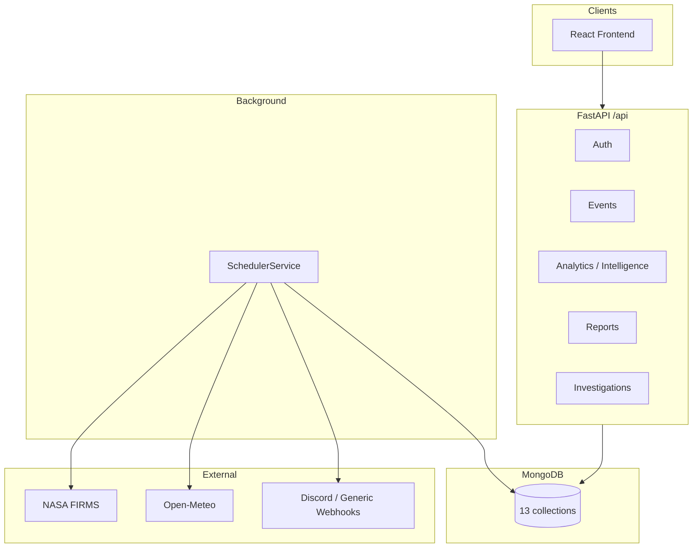
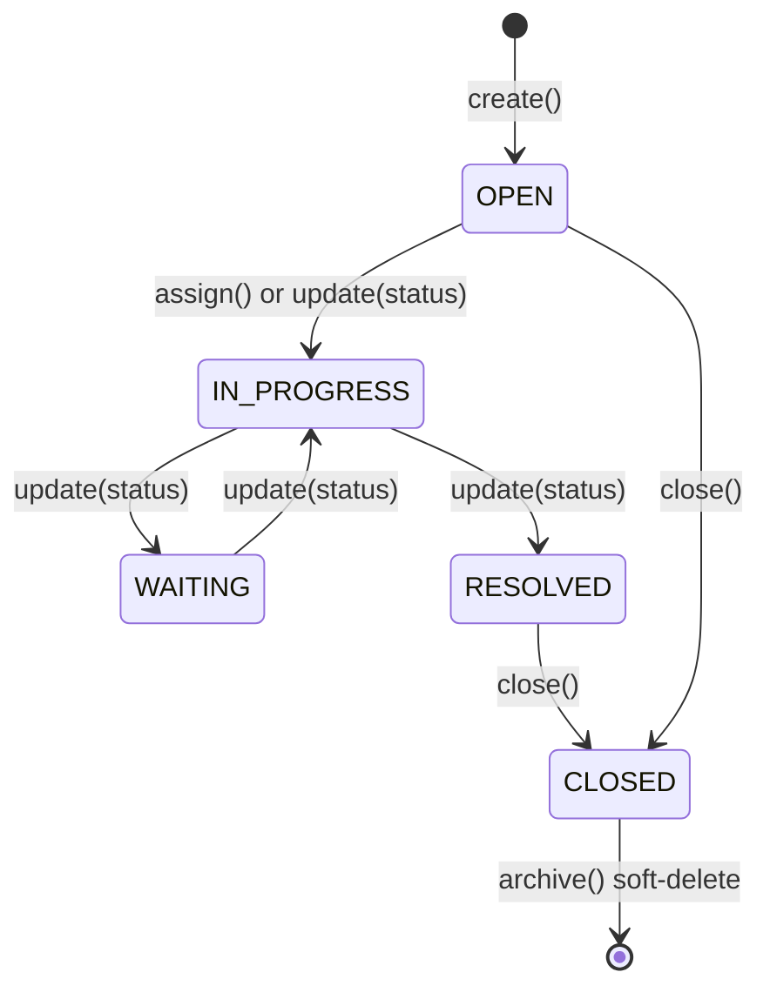
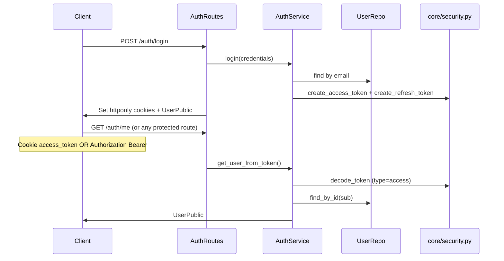

# ForestWatch Ecosystem Intelligence Platform — Implementation Architecture (As-Built)

**Version:** 0.3.0 (verified from `backend/server.py`)  
**Last audited:** 2026-07-07  
**Scope:** Documents only what is verified in the codebase.

> **Canonical architecture:** `docs/architecture/` is the single source of truth for
> all architectural concepts, contracts, and invariants (Architecture v1.0). This
> document is an **as-built implementation map** that shows how the current codebase
> realizes that architecture. Where an architectural concept is defined, this document
> references the canonical specification rather than restating it. Where the current
> implementation has not yet been aligned to canonical v1.0, the canonical specification
> governs the target design.

### Canonical references

| Concept | Canonical source |
|---------|------------------|
| Platform vision and boundaries | `docs/architecture/00-platform-vision.md` |
| Architectural invariants | `docs/architecture/01-architecture-principles.md` |
| Intelligence Engine and identity | `docs/architecture/02-intelligence-engine.md` |
| Reconciliation contract | `docs/architecture/03-reconciliation-engine.md` |
| Detector Framework | `docs/architecture/04-detector-framework.md` |
| Spatial Engine | `docs/architecture/05-spatial-engine.md` |
| Domain plug-in architecture | `docs/architecture/06-domain-plugin-architecture.md` |
| Reporting and Command Center | `docs/architecture/07-reporting-and-command-center.md` |
| System context and diagram | `docs/architecture/09-system-context.md` |
| Dependency rules | `docs/architecture/10-dependency-rules.md` |
| Decision records | `docs/architecture/adr/` |

---

## System Overview

ForestWatch is a full-stack environmental intelligence platform. It ingests forest disturbance events (primarily via NASA FIRMS and CSV import), stores them in MongoDB, runs analytics and anomaly detection, maintains operational intelligence events, and exposes dashboards, reports, investigations, and outbound notifications.



**Entry points:**
- Backend: `backend/server.py`
- Frontend: `frontend/src/index.js` → `App.js`

---

## Backend Architecture

> The normative layering, allowed/forbidden dependencies, and per-layer responsibilities
> are defined in `docs/architecture/10-dependency-rules.md` and
> `docs/architecture/01-architecture-principles.md`. The table below maps those rules to
> the current package layout.

Layered design under `backend/app/`:

| Layer | Path | Responsibility |
|-------|------|----------------|
| Core | `core/` | Config, logging, DB, security, errors, migrations |
| Models | `models/` | Pydantic domain models |
| Repositories | `repositories/` + module repos | MongoDB persistence |
| Services | `services/` | Cross-cutting business logic |
| Modules | `modules/` | Feature packages (analytics, ingestion, reports, investigations) |
| API | `api/` + module routes | FastAPI routers |

All HTTP routes mount under `/api` via `api_router` in `server.py`.

### Registered routers

| Router | Prefix | File |
|--------|--------|------|
| Auth | `/api/auth` | `app/api/auth_routes.py` |
| Data sources | `/api/data-sources` | `app/api/data_source_routes.py` |
| Events | `/api/events` | `app/api/event_routes.py` |
| Alerts (legacy) | `/api/alerts` | `app/api/alert_routes.py` |
| In-app notifications | `/api/notifications` | `app/api/notification_routes.py` |
| CSV import | `/api/import` | `app/api/import_routes.py` |
| Modules registry | `/api/modules` | `app/api/module_routes.py` |
| Analytics | `/api/analytics` | `app/modules/analytics/analytics_routes.py` |
| Reports | `/api/reports` | `app/modules/reports/report_routes.py` |
| Investigations | `/api/investigations` | `app/modules/investigations/investigation_routes.py` |

---

## Frontend Architecture

Create React App (CRACO) + React 19 + React Router 7.

| Area | Location | Role |
|------|----------|------|
| Routing | `frontend/src/App.js` | Public auth routes; protected dashboard pages |
| Auth state | `frontend/src/context/AuthContext.jsx` | Session via cookie-based API |
| HTTP | `frontend/src/lib/api.js` | Axios client (`withCredentials: true`) |
| API clients | `frontend/src/api/` | `analytics.js`, `reports.js`, `investigations.js` |
| Layout | `components/layout/AppLayout.jsx` | Sidebar navigation |
| Dashboard | `pages/DashboardPage.jsx` | Analytics + intelligence command center |
| Intelligence UI | `components/intelligence/*` | Live intel cards, map, risk, weather, history |
| Investigations UI | `pages/InvestigationsPage.jsx` | List, detail, create, close |
| Reports UI | `pages/ReportsPage.jsx` | Generate, list, download |
| Legacy map | `pages/MapPage.jsx` | Uses `/api/alerts` (not intelligence map) |

**Protected routes:** `/dashboard`, `/map`, `/modules`, `/reports`, `/investigations`, `/investigations/:id`

---

## Scheduler Workflow

> Scheduler responsibilities are defined normatively in
> `docs/architecture/adr/ADR-007-scheduler-responsibilities.md` and
> `docs/architecture/03-reconciliation-engine.md`: the scheduler orchestrates only, and
> reconciliation is a write operation owned by the scheduler
> (`docs/architecture/adr/ADR-011-read-write-separation.md`). The sequence below is the
> current as-built cycle.

Implemented in `app/services/scheduler_service.py`. Started at application startup when `ENABLE_BACKGROUND_INGESTION=true`.

```mermaid
sequenceDiagram
    participant Loop as SchedulerService._loop
    participant FIRMS as FIRMSProvider
    participant Weather as WeatherService
    participant Analytics as AnalyticsService
    participant Intel as IntelligenceEventsService
    participant Risk as RiskService
    participant Notif as IntelligenceNotificationService
    participant Reports as ReportService
    participant Runs as IngestionRunsRepository

    Loop->>FIRMS: run() — fetch, normalize, dedupe, persist
    Loop->>Weather: refresh_if_stale() (best-effort)
    Loop->>Analytics: reconcile_intelligence_events(intel)
    Loop->>Risk: persist_snapshot() (best-effort)
    Loop->>Notif: dispatch_cycle_notifications() (if enabled)
    Loop->>Reports: generate_scheduled_daily/weekly/monthly (best-effort)
    Loop->>Runs: create_run(status=success|failed)
    Loop->>Loop: sleep(poll_interval_minutes)
```

**Configuration** (`app/core/config.py`):
- `firms_poll_interval_minutes` (default 60)
- `enable_background_ingestion`
- `enable_scheduled_reports`

**Note:** `app/modules/ingestion/scheduler.py` is a scaffold registry only. The active scheduler is `SchedulerService`.

---

## Intelligence Pipeline

> The intelligence pipeline model — observations, detection, reconciliation, and tracked
> situations — is defined canonically in `docs/architecture/02-intelligence-engine.md`,
> `docs/architecture/03-reconciliation-engine.md`,
> `docs/architecture/04-detector-framework.md`, and
> `docs/architecture/09-system-context.md`.
>
> For the current step-by-step as-built implementation (file paths, endpoints, and
> tests), see `docs/INTELLIGENCE_PIPELINE.md`.

---

## Investigation Workflow

Operational objects independent from intelligence generation.



**Key files:**
- Service: `app/modules/investigations/investigation_service.py`
- Timeline: `app/repositories/investigation_timeline_repository.py` (insert-only)
- Optional link: `intelligence_event_id` on `Investigation`

---

## Reporting Workflow

1. Client calls `POST /api/reports/generate` → pending record in `reports` collection
2. `ReportService.generate_background()` gathers data via `ReportSectionRegistry`
3. Exports to PDF (`reportlab`), CSV, or JSON on disk (`settings.reports_dir`)
4. Scheduler may auto-generate daily/weekly/monthly reports when enabled

**15 built-in report sections** registered in `app/modules/reports/report_sections.py`.

---

## Notification Workflow

Two separate systems:

### A. Outbound intelligence webhooks (active when configured)
- **Service:** `IntelligenceNotificationService`
- **Providers:** `DiscordWebhookProvider`, `GenericWebhookProvider` via `build_providers()`
- **History:** `notification_history` collection
- **Triggers:** scheduler cycle diffs; investigation created/assigned/escalated/closed

### B. In-app user notifications
- **Service:** `NotificationService`
- **Collection:** `notifications`
- **API:** `/api/notifications`
- **Frontend consumer:** Not verified from implementation (no UI calls this API)

---

## Weather Pipeline

1. `OpenMeteoProvider` fetches observations for Romania regions
2. `WeatherService` caches in `weather_cache` (TTL via `weather_cache_ttl_minutes`, application-level — not MongoDB TTL index)
3. Scheduler calls `refresh_if_stale()` each cycle
4. `RiskService` incorporates weather score via `compute_weather_score()`

---

## GIS Pipeline

> The canonical geospatial architecture — reusable spatial index, polygon and overlay
> providers, and the additive enrichment pipeline — is defined in
> `docs/architecture/05-spatial-engine.md` and
> `docs/architecture/adr/ADR-003-spatial-engine.md`. The current implementation below is
> the land-cover realization of that engine.

1. Bundled GeoJSON: `app/data/gis/romania_corine_simplified.geojson`
2. `gis_loader.py` — spatial index, point-in-polygon
3. `gis_land_cover_service.py` — classifies coordinates → land cover type
4. `land_cover_service.py` — backward-compatible facade
5. Used during ingestion and `AnalyticsService.get_land_cover_distribution()`

Legacy `app/data/romania_landcover.py` exists but is superseded by GIS GeoJSON (only referenced in tests).

---

## Ecosystem Intelligence Architecture

> The ecosystem intelligence model — incident categories, threat categories, ecosystem
> domains, and how new domains plug in — is defined canonically in
> `docs/architecture/02-intelligence-engine.md` and
> `docs/architecture/06-domain-plugin-architecture.md`. Design notes for the current
> implementation live in `backend/app/core/ecosystem/ARCHITECTURE.md`. The tables below
> map the shared-kernel modules to code.

Core definitions in `app/core/ecosystem/`:

| Module | Purpose |
|--------|---------|
| `incident_categories.py` | `IncidentCategory` enum |
| `domains.py` | `EcosystemDomain` enum |
| `command_center.py` | `CommandCenterSnapshot`, `DomainModuleStatus` |
| `threat_categories.py` | `ThreatCategory`, `ThreatOrigin` |
| `threat_assessment.py` | `ThreatAssessment`, `PriorityLevel` |
| `threat_mapping.py` | Incident → threat mapping |

**Consumers:**
- `CommandCenterService.get_snapshot()`
- `ThreatAssessmentService`
- `incident_aggregation.py`
- `IntelligenceEventsService` (sets `incident_category`)

Additional design notes: `backend/app/core/ecosystem/ARCHITECTURE.md`

---

## Threat Engine

**Service:** `app/modules/analytics/threat_assessment_service.py`

- Reads active intelligence events via `IntelligenceEventsService`
- Maps `incident_category` → `ThreatCategory` via `threat_mapping.py`
- Produces `ThreatAssessment` with deterministic scoring from priority, severity, escalation, trend
- Exposed at `/api/analytics/intelligence/threats` and `/threat-summary`

---

## Risk Engine

**Service:** `app/modules/analytics/risk_service.py`

Combines:
- Current activity (analytics)
- Historical activity (history repo)
- Forest/land-cover signal
- Intelligence priority and escalation
- Weather score (when cache available)

Persists daily snapshots to `risk_history`. Exposed at `/api/analytics/intelligence/risk`.

---

## Authentication Flow



**Protected routes** use `get_current_user` from `app/api/deps.py`.

**Public routes (verified):** `/api/`, `/api/health`, `/api/auth/register|login|logout|refresh`, `/api/events/event-types`, `/api/data-sources/types`, `/api/modules/*`

---

## Dependency Injection

FastAPI `Depends()` factories in `app/api/deps.py`:

- **Repository deps:** `*_repo_dep(db=Depends(db_dep))`
- **Service deps:** compose repository deps
- **Cross-service deps:** e.g. `risk_service_dep`, `report_service_dep`, `command_center_service_dep`
- **App state access:** `investigation_service_dep` reads `request.app.state.notification_svc`

Request-scoped services are constructed per request via deps. Long-lived services (`notification_svc`, `weather_svc`, `report_svc`, `scheduler`) are set on `app.state` at startup.

---

## Startup Sequence

Verified order in `server.py` → `startup()`:

1. `get_db()` — MongoDB connection
2. Drop legacy `alerts` collection if present
3. Create indexes (13 collections)
4. `migrate_datetime_strings(db)`
5. `backfill_geojson_location(db)`
6. `AuthService.seed_admin()`
7. `DataSourceService.seed_demo()`
8. Re-seed `forest_events` if stale `source_id` references
9. `ForestEventService.seed_demo_data()`
10. `seed_romania_intelligence()` (idempotent)
11. Construct analytics, intel, notification, weather, risk, report, investigation services
12. Assign `app.state.notification_svc`, `weather_svc`, `report_svc`
13. Construct and start `SchedulerService` → `app.state.scheduler`

**Shutdown:** stop scheduler, `close_db()`

---

## Database Initialization

- **Connection:** `app/core/database.py` — Motor async client from `MONGO_URL`, database `DB_NAME`
- **Indexes:** all created in `server.py` startup (see `docs/DATABASE.md`)
- **Migrations:** `app/core/migrations.py` — datetime string conversion, GeoJSON backfill
- **Seeding:** admin user, data sources, demo forest events, Romania intelligence dataset

**TTL indexes:** Not verified from implementation. Weather staleness uses application-level TTL (`weather_cache_ttl_minutes`).

---

## Related Documentation

**Canonical architecture (source of truth):** `docs/architecture/` — see the canonical
references table at the top of this document.

**As-built implementation references:**

| Document | Contents |
|----------|----------|
| `DATABASE.md` | Collection schemas and indexes |
| `API_REFERENCE.md` | All HTTP endpoints |
| `PROJECT_STRUCTURE.md` | Package layout |
| `PROJECT_STATE.md` | Current project execution status |
| `INTELLIGENCE_PIPELINE.md` | Pipeline step-by-step (as-built) |
| `EXTENDING_FORESTWATCH.md` | Extension recipes (as-built) |
| `DEPENDENCIES.md` | External libraries |
| `CHANGELOG.md` | Project documentation changelog |
| `RELEASE_NOTES.md` | User-visible releases |
| `archive/` | Historical documentation snapshots |
