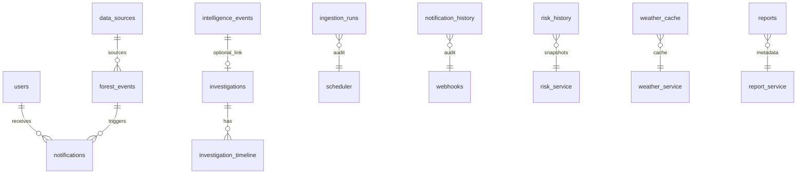

# ForestWatch — MongoDB Database Reference

**Database name:** from env `DB_NAME` (`app/core/config.py`)  
**Driver:** Motor (async) via `app/core/database.py`  
**Collections verified:** 13 active collections  
**TTL indexes:** Not verified from implementation (no `expireAfterSeconds` in `server.py`)

---

## Collection Overview

---

## 1. `users`

| Attribute | Value |
|-----------|-------|
| **Purpose** | User accounts and authentication |
| **Repository** | `UserRepository` (`app/repositories/user_repository.py`) |
| **Indexes** | `email` (unique) |
| **TTL** | None |
| **Write frequency** | Low (registration, admin seed, password updates) |
| **Read frequency** | Medium (every authenticated request via `get_current_user`) |

**Main schema** (`app/models/user.py` — `User` extends `BaseDocument`):
- `email`, `name`, `password_hash`, `role`, `provider`, `created_at`

**Referenced by:** `AuthService`, `NotificationService` (recipient)

**Used by:** `auth_routes`, all protected endpoints

---

## 2. `data_sources`

| Attribute | Value |
|-----------|-------|
| **Purpose** | Catalog of event data sources (FIRMS, CSV, manual, etc.) |
| **Repository** | `DataSourceRepository` |
| **Indexes** | `name` (unique), `type` |
| **Relations** | Referenced by `forest_events.source_id` |
| **Write frequency** | Low (seed + admin CRUD) |
| **Read frequency** | Medium (event joins, ingestion) |

**Main schema** (`app/models/data_source.py`):
- `name`, `type`, `status`, `url`, `metadata`, timestamps

**Used by:** `DataSourceService`, `ForestEventService`, `FIRMSProvider`, `CsvImporter`

---

## 3. `forest_events`

| Attribute | Value |
|-----------|-------|
| **Purpose** | Canonical store for all detected forest disturbance events |
| **Repositories** | `ForestEventRepository`, `AnalyticsRepository`, `HistoryRepository` |
| **Indexes** | `severity`, `event_type`, `country`, `source_id`, `detected_at`, `metadata.dedupe_key` (sparse), `location` (2dsphere) |
| **Relations** | `source_id` → `data_sources`; referenced by `notifications.forest_event_id` |
| **Write frequency** | High (scheduler FIRMS cycle, CSV import, manual CRUD) |
| **Read frequency** | High (analytics, maps, history, risk) |

**Main schema** (`app/models/forest_event.py` — `ForestEvent`):
- `title`, `country`, `region`, `latitude`, `longitude`, `location` (GeoJSON Point)
- `event_type`, `severity`, `affected_area_ha`, `confidence`
- `source_id`, `detected_at`, `status`, `land_cover_type`, `metadata`

**Dedup:** `metadata.dedupe_key` via `app/modules/ingestion/dedupe.py`

**Used by:** `ForestEventService`, `AnalyticsService`, `HistoryService`, `RiskService`, scheduler

---

## 4. `notifications`

| Attribute | Value |
|-----------|-------|
| **Purpose** | In-app user notifications (distinct from webhook `notification_history`) |
| **Repository** | `NotificationRepository` |
| **Indexes** | `recipient_user_id`, `forest_event_id`, `created_at` |
| **Relations** | `recipient_user_id` → `users`, `forest_event_id` → `forest_events` |
| **Write frequency** | Low (when notification creation is triggered) |
| **Read frequency** | Low (API exists; frontend UI not verified) |

**Main schema** (`app/models/notification.py`):
- `recipient_user_id`, `forest_event_id`, `title`, `message`, `severity`, `read`, `created_at`

**Used by:** `NotificationService`, `notification_routes`

---

## 5. `import_jobs`

| Attribute | Value |
|-----------|-------|
| **Purpose** | CSV import job tracking |
| **Repositories** | `ImportJobRepository`, `AnalyticsRepository` |
| **Indexes** | `created_at`, `status` |
| **Write frequency** | Low (on CSV upload) |
| **Read frequency** | Low |

**Main schema** (`app/models/import_job.py`):
- `source_id`, `filename`, `status`, `rows_total`, `rows_imported`, `rows_skipped`, `errors`, `created_at`, `completed_at`

**Used by:** `CsvImporter`, `import_routes`

---

## 6. `intelligence_events`

| Attribute | Value |
|-----------|-------|
| **Purpose** | Persisted operational intelligence observations (anomalies) |
| **Repositories** | `IntelligenceEventsRepository`, `HistoryRepository` |
| **Indexes** | compound `(event_type, region, status)`, `last_detected_at` |
| **Relations** | Optionally linked from `investigations.intelligence_event_id` |
| **Write frequency** | Medium (each scheduler reconcile cycle) |
| **Read frequency** | High (dashboard, threat, command center, reports) |

**Main schema** (`app/models/intelligence_event.py`):
- `event_type`, `incident_category`, `region`, `status` (`active`|`resolved`)
- `severity`, `escalation_level`, `previous_score`, `trend`, `priority_score`
- `first_detected_at`, `last_detected_at`, `detection_count`, `current_score`
- `metadata`, `resolved_at`

**Dedup key:** one active event per `(event_type, region)` pair

**Used by:** `IntelligenceEventsService`, `ThreatAssessmentService`, `InvestigationService`, scheduler notifications

---

## 7. `ingestion_runs`

| Attribute | Value |
|-----------|-------|
| **Purpose** | Audit trail for scheduler cycles |
| **Repository** | `IngestionRunsRepository` |
| **Indexes** | `started_at` (descending) |
| **Write frequency** | Once per scheduler cycle |
| **Read frequency** | Low (ingestion status endpoint, reports) |

**Schema** (documented in repository):
- `started_at`, `completed_at`, `duration_seconds`, `source`, `status`
- `events_fetched`, `events_inserted`, `duplicates_skipped`, `error`

**Used by:** `SchedulerService`, `/api/analytics/intelligence/ingestion-status`, report section `ingestion_runs`

---

## 8. `notification_history`

| Attribute | Value |
|-----------|-------|
| **Purpose** | Outbound webhook delivery audit |
| **Repository** | `NotificationHistoryRepository` |
| **Indexes** | `sent_at` (descending) |
| **Write frequency** | Per notification dispatch attempt |
| **Read frequency** | Low (status endpoint, reports) |

**Schema:**
- `provider`, `event_type`, `region`, `sent_at`, `success`, `error`

**Used by:** `IntelligenceNotificationService`, `/api/analytics/intelligence/notifications`

---

## 9. `risk_history`

| Attribute | Value |
|-----------|-------|
| **Purpose** | Daily regional fire risk snapshots |
| **Repository** | `RiskRepository` |
| **Indexes** | `date` (unique), `created_at` (descending) |
| **Write frequency** | Once per scheduler cycle (idempotent per UTC day) |
| **Read frequency** | Medium (risk endpoint, reports) |

**Schema:**
- `date` (YYYY-MM-DD UTC), `created_at`, `regions[]` with `risk_score`, `risk_level`, `change`, `breakdown`

**Used by:** `RiskService`, `/api/analytics/intelligence/risk`

---

## 10. `weather_cache`

| Attribute | Value |
|-----------|-------|
| **Purpose** | Cached regional weather observations |
| **Repository** | `WeatherCacheRepository` |
| **Indexes** | `region` (unique), `cached_at` (descending) |
| **TTL** | Application-level via `weather_cache_ttl_minutes` — **not** a MongoDB TTL index |
| **Write frequency** | When cache stale (scheduler refresh) |
| **Read frequency** | Medium (weather endpoint, risk computation) |

**Schema:**
- `region`, `latitude`, `longitude`, `temperature`, `humidity`, `wind_speed`, `wind_direction`, `precipitation`, `weather_code`, `source`, `confidence`, `observed_at`, `cached_at`

**Used by:** `WeatherService`, `/api/analytics/intelligence/weather`

---

## 11. `reports`

| Attribute | Value |
|-----------|-------|
| **Purpose** | Report generation metadata |
| **Repository** | `ReportRepository` |
| **Indexes** | `generated_at` (desc), compound `(type, period_start)` |
| **Write frequency** | On-demand + scheduled generation |
| **Read frequency** | Low |

**Schema** (`ReportRecord` in `report_models.py`):
- `type`, `format`, `status`, `generated_at`, `period_start`, `period_end`
- `file_path`, `file_size`, `generation_time_ms`, `summary`, `error`

**Used by:** `ReportService`, `report_routes`

---

## 12. `investigations`

| Attribute | Value |
|-----------|-------|
| **Purpose** | Operational investigation workflow objects |
| **Repository** | `InvestigationRepository` |
| **Indexes** | compound `(status, priority)`, `updated_at` (desc), `intelligence_event_id` (sparse), `region` |
| **Relations** | Optional `intelligence_event_id` → `intelligence_events` |
| **Write frequency** | User-driven (create, update, assign, close, archive) |
| **Read frequency** | Medium (investigations UI, command center, reports) |

**Schema** (`app/models/investigation.py` — `Investigation`):
- `intelligence_event_id`, `title`, `description`, `status`, `priority`
- `assigned_to`, `organization`, `created_by`, `created_at`, `updated_at`, `closed_at`
- `resolution`, `tags`, `recommended_actions`, `actual_actions`, `outcome`, `region`, `archived`

**Used by:** `InvestigationService`, investigation routes, command center, report section `investigation_summary`

---

## 13. `investigation_timeline`

| Attribute | Value |
|-----------|-------|
| **Purpose** | Immutable audit timeline for investigations |
| **Repository** | `InvestigationTimelineRepository` (insert-only) |
| **Indexes** | compound `(investigation_id, created_at)` |
| **Relations** | `investigation_id` → `investigations` |
| **Write frequency** | On investigation lifecycle events |
| **Read frequency** | Medium (detail view) |

**Schema** (`InvestigationTimelineEntry`):
- `investigation_id`, `event_type`, `message`, `actor`, `metadata`, `created_at`

**Event types:** `threat_detected`, `investigation_created`, `assigned`, `evidence_uploaded`, `comment_added`, `status_changed`, `priority_changed`, `closed`

**Used by:** `InvestigationService`

---

## Legacy Collection

| Collection | Status |
|------------|--------|
| `alerts` | Dropped at startup if present (`server.py`). Replaced by forest-event-based alerting via `AlertService`. |

---

## Index Creation Source

All indexes are created exclusively in `backend/server.py` → `startup()`. No other `create_index` calls verified in the codebase.
