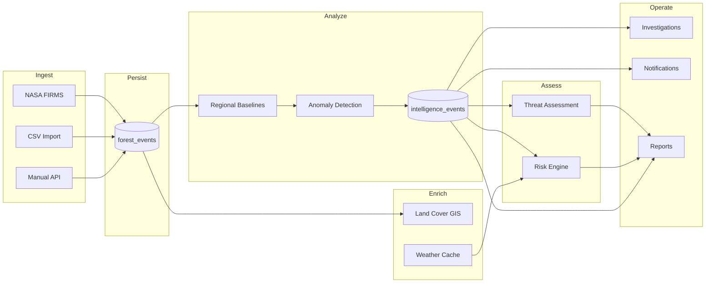
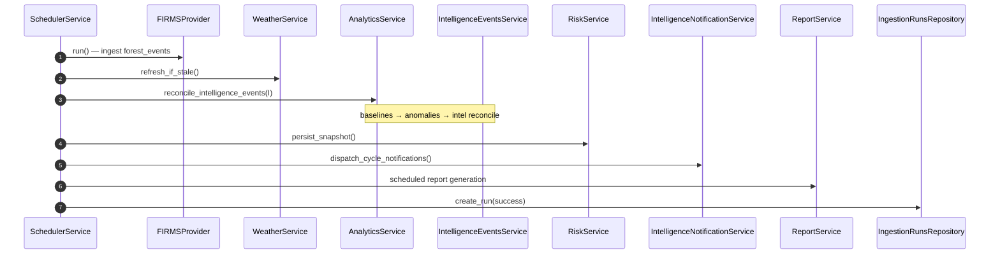

# ForestWatch — Intelligence Pipeline (As-Built)

Step-by-step description of how raw events become operational intelligence.  
All steps verified from `SchedulerService`, `AnalyticsService`, and related modules.

> **Canonical architecture:** The conceptual pipeline model — the Intelligence Engine,
> the reconciliation contract, the Detector Framework, and the end-to-end system context
> — is defined in `docs/architecture/` (Architecture v1.0), specifically
> `02-intelligence-engine.md`, `03-reconciliation-engine.md`, `04-detector-framework.md`,
> and `09-system-context.md`. This document is the **as-built implementation reference**
> and does not restate those concepts. Where a step below reflects current code that has
> not yet been aligned to canonical v1.0, the canonical specification governs the target
> design and the divergence is called out inline.

---

## Pipeline Overview

---

## 1. Event Ingestion

### 1a. Scheduled FIRMS ingestion (primary)

**Trigger:** `SchedulerService._run_cycle()` → `FIRMSProvider.run()`

**File:** `app/modules/ingestion/providers/firms.py`

Steps:
1. Fetch active fire data from NASA FIRMS API (or mock when `FIRMS_API_KEY` empty)
2. Normalize each record to `ForestEventCreate` shape
3. Route through `persist_import_event()` (`app/modules/ingestion/persist.py`)
4. Dedup via `metadata.dedupe_key` (`app/modules/ingestion/dedupe.py`)
5. Classify land cover at ingest time via `GISLandCoverService`
6. Insert into `forest_events` collection

**Audit:** cycle logged to `ingestion_runs`

### 1b. CSV import

**Trigger:** `POST /api/import/csv`

**File:** `app/modules/ingestion/csv_importer.py`

Steps:
1. Validate CSV header and rows
2. Same persist + dedupe pipeline as FIRMS
3. Track job in `import_jobs`

### 1c. Manual event creation

**Trigger:** `POST /api/events`

**File:** `app/services/forest_event_service.py`

### 1d. Demo / seed data

**Triggers:** startup seeding in `server.py`

- Global demo events via `ForestEventService.seed_demo_data()`
- Romania intelligence dataset via `seed_romania_intelligence()`

---

## 2. Weather Enrichment

**Not applied at ingest time for every event.** Weather is a regional cache refreshed by the scheduler.

**Flow:**
1. `SchedulerService` calls `WeatherService.refresh_if_stale()` each cycle
2. `OpenMeteoProvider` fetches observations for Romania monitoring regions
3. Results upserted to `weather_cache` (one doc per region)
4. Staleness determined by `weather_cache_ttl_minutes` (application-level, not Mongo TTL index)

**Consumer:** `RiskService` via `compute_weather_score()`

**API:** `GET /api/analytics/intelligence/weather`

---

## 3. Land Cover Classification

**At ingestion:** `GISLandCoverService.classify(lat, lng)` called during persist

**Files:**
- `app/services/gis_loader.py` — loads `romania_corine_simplified.geojson`, builds spatial index
- `app/services/gis_land_cover_service.py` — point-in-polygon lookup
- `app/services/land_cover_service.py` — public facade

**Stored on:** `forest_events.land_cover_type`

**Analytics aggregation:** `AnalyticsService.get_land_cover_distribution()` groups events by land cover

**API:** `GET /api/analytics/intelligence/land-cover`

---

## 4. Anomaly Detection

> **Canonical target:** Detection is defined canonically by the Detector Framework
> (`docs/architecture/04-detector-framework.md`,
> `docs/architecture/adr/ADR-004-detector-framework.md`), which segments observations by
> `(spatial_key, incident_category)` and emits the canonical Detection envelope
> (`docs/architecture/adr/ADR-009-detection-contract.md`). The single-rule regional
> anomaly detector below is the current realization.

**Trigger:** each scheduler cycle after FIRMS ingestion

**File:** `app/modules/analytics/analytics_service.py`

Steps:
1. `get_regional_baselines()` — compute expected activity per Romania region
2. `get_anomalies()` — compare current window vs baseline; flag deviations
3. Returns anomaly list with region, severity, deviation metrics

**API:** 
- `GET /api/analytics/intelligence/baselines`
- `GET /api/analytics/intelligence/anomalies`

**Tests:** `test_anomaly_detection.py`, `test_regional_baselines.py`

---

## 5. Intelligence Event Reconciliation

**Trigger:** `AnalyticsService.reconcile_intelligence_events(intelligence_svc)` in scheduler cycle

**Files:**
- `app/modules/analytics/intelligence_events_service.py` — `reconcile()`
- `app/modules/analytics/intelligence_events_repository.py` — persistence

Steps:
1. Receive anomaly list from analytics
2. For each region anomaly: upsert active `IntelligenceEvent` or update scores
3. Compute escalation level, trend, priority score (pure functions in service)
4. Set `incident_category` (defaults to `wildfire` for legacy compatibility)
5. Resolve events no longer in anomaly set (status → `resolved`)

**Dedup (current implementation):** one active event per `(event_type, region)`.

> **Canonical target:** The reconciliation contract, guarantees, and invariants are
> defined in `docs/architecture/03-reconciliation-engine.md`. Canonical intelligence
> identity is `(incident_category, spatial_key)` — see
> `docs/architecture/adr/ADR-001-canonical-intelligence-identity.md` and
> `docs/architecture/adr/ADR-008-intelligence-event-model.md`. The `(event_type, region)`
> key above is the pre-v1.0 implementation and is superseded by the canonical identity.

**Collection:** `intelligence_events`

**API:**
- `GET /api/analytics/intelligence/events`
- `GET /api/analytics/intelligence/events/summary`

> **Canonical target:** Reconciliation is a write operation owned by the scheduler;
> GET endpoints do not reconcile — see
> `docs/architecture/adr/ADR-011-read-write-separation.md`. The current
> `GET /api/analytics/intelligence/events` handler triggers reconciliation on read; this
> is the pre-v1.0 behavior and is superseded by that ADR.

---

## 6. Threat Assessment

**On-demand** (not part of scheduler cycle directly — computed when API/report requested)

**File:** `app/modules/analytics/threat_assessment_service.py`

Steps:
1. Load active intelligence events
2. Map `incident_category` → `ThreatCategory` via `app/core/ecosystem/threat_mapping.py`
3. Build `ThreatAssessment` with deterministic scoring from priority, severity, escalation, trend
4. Group into natural/human/environmental/unknown origins

**API:**
- `GET /api/analytics/intelligence/threats`
- `GET /api/analytics/intelligence/threat-summary`

**Report section:** `environmental_threat_assessment`

---

## 7. Risk Computation

**Trigger:** scheduler cycle (best-effort) via `RiskService.persist_snapshot()`

**File:** `app/modules/analytics/risk_service.py`

Inputs:
- Current regional activity (analytics)
- Historical activity (history repo)
- Forest/land-cover signal
- Intelligence priority and escalation levels
- Weather score from cache

Output:
- Per-region `risk_score`, `risk_level`, `change`, `breakdown`
- Daily snapshot in `risk_history`

**API:** `GET /api/analytics/intelligence/risk`

---

## 8. Investigation Creation

**Trigger:** user action (not automatic from intelligence pipeline)

**File:** `app/modules/investigations/investigation_service.py`

Steps:
1. User creates investigation via UI or `POST /api/investigations`
2. Optionally links `intelligence_event_id` (one active investigation per intel event)
3. Copies region and recommended actions from linked intel event
4. Appends immutable timeline entries
5. Sends `notify_investigation_created()` if notification service configured

**Frontend entry:** "Investigate" button on `ActiveIntelligenceEvents` → pre-filled create modal

---

## 9. Notifications

### Cycle notifications (scheduler)

**File:** `app/services/intelligence_notification_service.py`

After each reconcile cycle, `dispatch_cycle_notifications()` compares current vs previous active intel events:

| Trigger | Method |
|---------|--------|
| New anomaly | `notify_new_anomaly()` |
| Escalation change | `notify_escalation_change()` |
| New critical anomaly | `notify_new_critical_anomaly()` |
| Reliability alert | `notify_reliability_alert()` |

Providers: Discord webhook, generic HTTP webhook (when URLs configured)

History: `notification_history` collection

### Investigation notifications

| Event | Method |
|-------|--------|
| Created | `notify_investigation_created()` |
| Assigned | `notify_investigation_assigned()` |
| Priority escalated | `notify_investigation_escalated()` |
| Closed | `notify_investigation_closed()` |

**API status:** `GET /api/analytics/intelligence/notifications`

---

## 10. Reports

**On-demand:** `POST /api/reports/generate`

**Scheduled:** scheduler calls `ReportService.generate_scheduled_daily/weekly/monthly()`

**Gathering:** `ReportService.gather_report_data()` iterates `ReportSectionRegistry`:

| Section key | Data source |
|-------------|-------------|
| `overview` | AnalyticsService |
| `anomalies` | AnalyticsService |
| `land_cover` | AnalyticsService |
| `intelligence_events` | IntelligenceEventsService |
| `risk` | RiskService |
| `daily_activity` | HistoryService |
| `regional_history` | HistoryService |
| `hotspots` | HistoryService |
| `monthly_summary` | HistoryService |
| `weather` | WeatherService |
| `notifications` | NotificationHistoryRepository |
| `ingestion_runs` | IngestionRunsRepository |
| `incident_aggregation` | AnalyticsService |
| `environmental_threat_assessment` | ThreatAssessmentService |
| `investigation_summary` | InvestigationService |

Export formats: PDF (ReportLab), CSV, JSON

---

## 11. Scheduler Cycle (Complete Sequence)

**Interval:** `FIRMS_POLL_INTERVAL_MINUTES` (default 60)  
**Disable:** `ENABLE_BACKGROUND_INGESTION=false`

---

## 12. Command Center Snapshot

**On-demand:** `GET /api/analytics/intelligence/command-center`

**File:** `app/modules/analytics/command_center_service.py`

Aggregates in one response:
- Domain module status catalog
- Incident aggregation by category
- Active intel by category
- Threat distribution and top threats
- Investigation statistics
- Weather (optional)

**Frontend:** `IntelligenceSection` + `InvestigationsCommandCenterCard`

---

## 13. Incident Aggregation

**File:** `app/modules/analytics/incident_aggregation.py`

Pluggable aggregator registry. Default: `WildfireIncidentAggregator` wrapping existing analytics methods.

**API:** `GET /api/analytics/intelligence/incidents`

**Report section:** `incident_aggregation`

---

## Data Flow Timing

| Stage | When | Frequency |
|-------|------|-----------|
| FIRMS ingest | Scheduler cycle | Every N minutes |
| Land cover classify | At event persist | Per new event |
| Weather refresh | Scheduler cycle | When cache stale |
| Anomaly + intel reconcile | Scheduler cycle | Every N minutes |
| Risk snapshot | Scheduler cycle | Every N minutes (idempotent/day) |
| Threat assessment | API/report request | On demand |
| Investigations | User action | Ad hoc |
| Notifications | After reconcile + investigation actions | Event-driven |
| Reports | User action + scheduler | Ad hoc + scheduled |

---

## Verified Gaps

| Item | Status |
|------|--------|
| Automatic investigation creation from intel events | **Not verified** — investigations are user-initiated |
| Email/SMS alerting module | **Not implemented** — `modules/alerting/` is placeholder |
| In-app notification UI | **Not verified from implementation** |
| `fetchThreatSummary()` frontend call | Defined but **not used** by any component |
