# ForestWatch — Roadmap

**Last updated:** 2026-07-17

This roadmap replaces earlier checklists at the repository root. Completed work is marked ✓. Future work is grouped by **priority** (P0–P3) and **delivery phase**.

> **Scope:** This document is the **product and feature delivery roadmap**. The
> **architectural evolution roadmap** — architecture phases, engine generalization, and
> planned architecture versions — is canonical and lives in
> `docs/architecture/08-roadmap.md` and `docs/architecture/CHANGELOG.md`. Where feature
> work below touches architectural concepts (provider framework, detectors, spatial
> datasets, multi-tenancy), the canonical architecture documents govern the design.

### Terminology — do not confuse phase numbering

This document and `docs/architecture/08-roadmap.md` both use the word "phase" but refer to
**different scopes**. They **MUST NOT** be treated as the same numbering scheme.

| Term | Document | Range | Meaning |
|------|----------|-------|---------|
| **Architecture Phase** | `docs/architecture/08-roadmap.md` | 0–3 (+ future) | Engine evolution, domain onboarding, surface layer. Governs engineering work packages. |
| **Delivery Phase** | This document (`docs/ROADMAP.md`) | 1–9 | Product and feature delivery milestones (platform, ingestion, UI, data sources). |

When implementing architectural work (e.g. Phase 0 WP2), **always** use Architecture Phase
numbers from `docs/architecture/08-roadmap.md`. Delivery Phase numbers in this document are
historical product milestones only.

---

## Completed — Delivery Phase 1: Core Platform ✓

| Item | Status |
|------|--------|
| Authentication (JWT, cookies, register/login) | ✓ |
| Dashboard (KPIs, severity bar, recent activity) | ✓ |
| Interactive map (Leaflet, severity filters, popups) | ✓ |
| Modules page (backend capability registry) | ✓ |
| ForestEvent canonical domain model | ✓ |
| DataSource registry model + CRUD API | ✓ |
| MongoDB persistence + repository pattern | ✓ |
| Service layer + dependency injection | ✓ |
| Configuration management (`.env`) | ✓ |
| Logging + global error handling | ✓ |
| Legacy `/api/alerts` adapter (dashboard/map compat) | ✓ |
| Notification model + basic list/read API | ✓ |
| Demo seed (admin, 6 data sources, 20 events) | ✓ |
| Backend integration test suite (138 tests) | ✓ |
| Env templates (`backend/.env.example`, `frontend/.env.example`) | ✓ |

---

## Completed — Delivery Phase 2: Data Model & Geospatial ✓

| Item | Status |
|------|--------|
| Timezone-aware UTC datetimes (BSON + API) | ✓ |
| Startup datetime string migration | ✓ |
| `GET /api/events/recent` and `/range` | ✓ |
| GeoJSON `location` on ForestEvent | ✓ |
| 2dsphere index + geo backfill migration | ✓ |
| `GET /api/events/nearby` (`$nearSphere`) | ✓ |
| `GET /api/events/bbox` (`$geoWithin`) | ✓ |
| Location sync on create/update | ✓ |

---

## Completed — Delivery Phase 3: Ingestion & Analytics ✓

| Item | Status |
|------|--------|
| CSV upload (`POST /api/import/csv`) | ✓ |
| Row-level validation + partial failure handling | ✓ |
| ImportJob audit trail (`import_jobs` collection) | ✓ |
| Import status endpoints | ✓ |
| Ingestion module (`status=active`, CSV live) | ✓ |
| Analytics overview, countries, event-types, severity | ✓ |
| Analytics trends (day/week/month `$dateTrunc`) | ✓ |
| Analytics module (`status=active`, 5 endpoints live) | ✓ |
| Scheduler registry scaffold (no runner) | ✓ |

---

## Delivery Phase 4 — Real Data Integration (P0 / next)

**Goal:** First live environmental dataset without building the full provider framework.

| Priority | Item | Rationale |
|----------|------|-----------|
| **P0** | NASA FIRMS MVP (`FirmsImporter` parallel to `CsvImporter`) | Smallest path to real fire data; design complete |
| **P0** | `NASA_FIRMS_MAP_KEY` env + seeded `DataSource` row | Operational prerequisite |
| **P0** | `POST /api/import/firms` manual trigger | Reuses `ImportJob` + `ForestEventService` |
| **P0** | FIRMS idempotency via `metadata.firms_key` | Prevent duplicate events on re-pull |
| **P1** | Basic duplicate detection for CSV imports | Content-hash or row-key skip |
| **P1** | Frontend: analytics dashboard (wire `/api/analytics/*`) | Backend ready; UI missing |
| **P1** | Frontend: CSV upload form | API exists; no UI |
| **P2** | DataSource management UI | Admin workflow |
| **P2** | Per-source health field on `DataSource` (`last_run_at`, `last_error`) | Observability |

**Explicitly deferred from Phase 4:** Full provider registry, orchestrator, unified pipeline abstraction.

---

## Delivery Phase 5 — Ingestion Framework (P1)

**Goal:** Generalize after second provider (FIRMS + one more) proves patterns.

| Priority | Item |
|----------|------|
| **P1** | `IngestionProvider` protocol + `ProviderRegistry` |
| **P1** | `IngestionOrchestrator` (run lifecycle) |
| **P1** | Shared `IngestionPipeline` (validate → dedupe → persist) |
| **P1** | Generalize `ImportJob` → `IngestionRun` (or extend schema) |
| **P1** | `DataSource.provider_config` + `credentials_ref` |
| **P2** | Dead-letter collection + replay endpoint |
| **P2** | `/api/ingestion/*` unified routes; deprecate `/api/import/*` shims |

See [ARCHITECTURE.md](./ARCHITECTURE.md) for full framework design.

---

## Delivery Phase 6 — Automation & Scheduling (P1)

| Priority | Item |
|----------|------|
| **P1** | APScheduler runner on FastAPI startup |
| **P1** | Cron binding from `DataSource.schedule_cron` |
| **P1** | Watermark / cursor tracking on `DataSource` |
| **P1** | Overlap guard (skip if run already `running`) |
| **P2** | Long-running satellite jobs via in-process background tasks or APScheduler job queue *(architecture-gated: external job queues such as arq + Redis require an ADR and architecture version bump per Architecture v1.0; not approved)* |
| **P2** | `POST /api/ingestion/run` → `202 Accepted` for async runs |

---

## Delivery Phase 7 — Additional Data Sources (P2)

| Priority | Item |
|----------|------|
| **P2** | Global Forest Watch (GLAD / integrated alerts API) |
| **P2** | MapBiomas / Hansen automated pulls |
| **P2** | Web scraper provider (InfoAmazonia pilot) |
| **P2** | Cross-source deduplication and correlation |
| **P3** | Enrichment mode (scraper updates `metadata` vs new events) |

---

## Delivery Phase 8 — Satellite & Intelligence (P2–P3)

| Priority | Item |
|----------|------|
| **P2** | Satellite module: STAC discovery, NDVI delta |
| **P2** | Change detection → `wildfire` / `logging` events |
| **P3** | Alerting module: dispatch, delivery receipts |
| **P3** | AI predictions: risk scoring, forecasts |
| **P3** | Notification subscriptions per user/region |

---

## Delivery Phase 9 — Platform Expansion (P3)

| Priority | Item |
|----------|------|
| **P3** | Role-based ACL (admin vs analyst vs viewer) |
| **P3** | Public read-only API / embeddable widget |
| **P3** | Research exports (CSV/GeoJSON bulk download) |
| **P3** | Multi-tenant / organization support |
| **P3** | NGO dashboard templates |

---

## Technical debt & quality (ongoing)

| Priority | Item |
|----------|------|
| **P1** | Wire dashboard to `/api/analytics` (or `/api/events/stats`) consistently |
| **P1** | Add frontend automated tests (Jest + RTL) |
| **P2** | Convert backend integration tests to support in-process TestClient (optional local CI) |
| **P2** | Fix `GET /api/modules/{name}` → HTTP 404 for unknown modules |
| **P2** | Require auth on `/api/events/event-types` and `/api/data-sources/types` |
| **P2** | Analytics trend bucket zero-fill for chart UX |
| **P3** | Replace root `README.md` stub with setup guide linking to `docs/` |
| **P3** | Consolidate duplicate `.venv` directories |

---

## Suggested execution order (next 3 milestones)

```mermaid
gantt
    title Near-term milestones
    dateFormat YYYY-MM
    section Milestone A
    NASA FIRMS MVP importer     :a1, 2026-06, 2w
    section Milestone B
    Analytics frontend charts   :a2, after a1, 2w
    CSV upload UI               :a3, after a1, 1w
    section Milestone C
    APScheduler + FIRMS cron      :a4, after a2, 2w
    Provider framework extract    :a5, after a4, 3w
```

1. **Milestone A** — NASA FIRMS manual pull (no framework)
2. **Milestone B** — Frontend surfaces for analytics + CSV import
3. **Milestone C** — Scheduler + refactor toward provider framework when adding GFW

---

## Out of scope (current vision)

- Mobile native apps
- Real-time WebSocket alert streaming
- Multi-region MongoDB sharding
- Paid SaaS billing / tenancy billing
