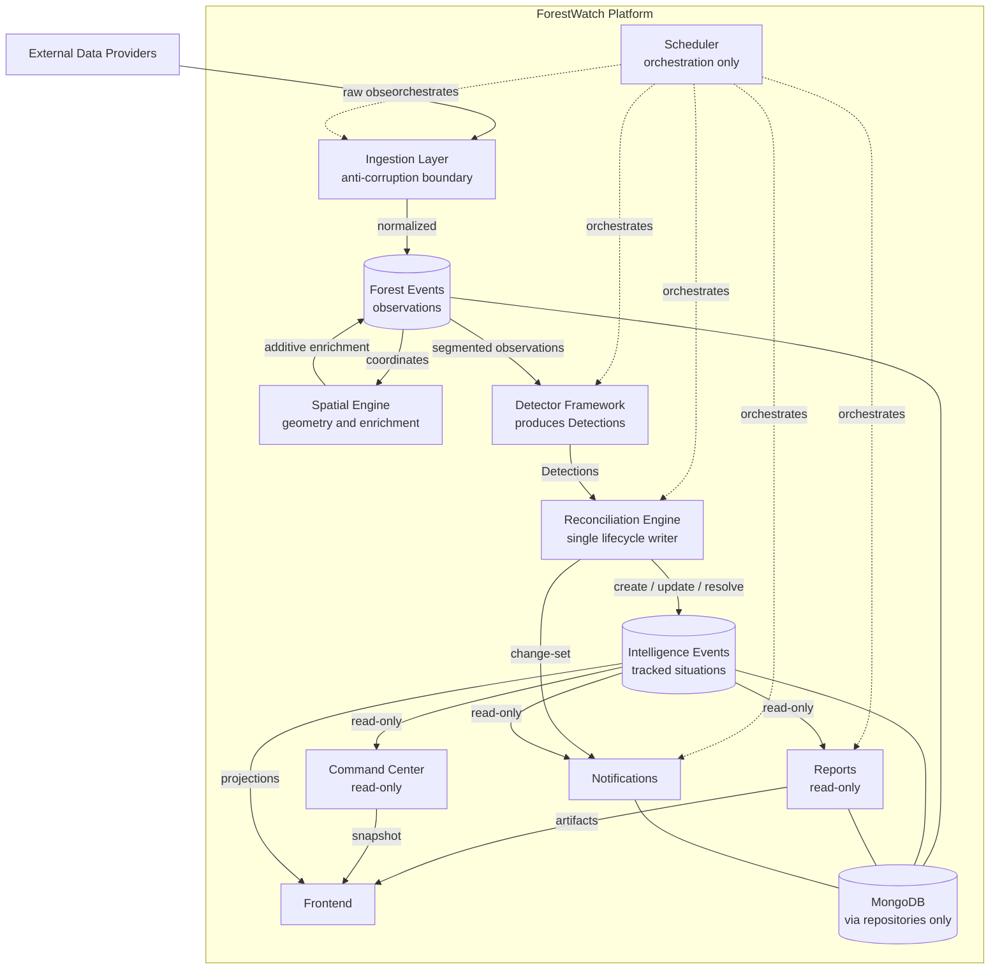

# 09 — System Context

## 1. Purpose

This document provides the high-level architectural overview of the entire ForestWatch
platform. It describes the responsibilities, information flow, ownership, and
boundaries of every major component. It is descriptive of structure and normative of
boundaries. It does not describe implementation details.

## 2. System Overview

ForestWatch shall be understood as a single intelligence pipeline that transforms
external and internal observations into tracked situations and operational outputs. The
platform is composed of the components described below. Each component shall hold the
responsibilities defined here and shall respect the boundaries defined here.

## 3. Components

### 3.1 External Data Providers
External data providers are systems outside the platform that supply raw environmental
observations. They shall be treated as untrusted external sources. The platform shall
not depend on their schemas internally.

### 3.2 Ingestion Layer
The ingestion layer is responsible for acquiring observations from external and
internal sources and normalizing them to canonical models. The ingestion layer shall
act as the anti-corruption boundary of the platform. External schemas shall not
propagate beyond it.

### 3.3 Scheduler
The scheduler is responsible for sequencing pipeline steps. It shall own no business
logic. It shall invoke ingestion, enrichment, detection, reconciliation, snapshots,
notification dispatch, and scheduled report generation. It shall enforce that
reconciliation runs under a single-runner guarantee.

### 3.4 Forest Events
Forest Events are the canonical observation records of the platform. They shall be
immutable once ingested. They carry location, time, source, confidence, severity, and
additive spatial enrichments. They are the input to segmentation and detection.

### 3.5 Spatial Engine
The Spatial Engine provides all geospatial indexing, membership resolution, and
classification. It enriches observations with additive, namespaced spatial context. It
is the single owner of geometry computation.

### 3.6 Detector Framework
The Detector Framework consumes segmented observations and produces normalized
Detections. It is the only component that carries domain knowledge about how a
situation is recognized. It hands Detections to the Reconciliation Engine.

### 3.7 Reconciliation Engine
The Reconciliation Engine owns the lifecycle of Intelligence Events. It creates,
updates, and resolves Intelligence Events from Detections. It is the single writer of
intelligence lifecycle state. It emits a change-set describing lifecycle transitions.

### 3.8 Intelligence Events
Intelligence Events are the canonical tracked-situation records of the platform. They
carry identity, lifecycle state, dynamics, and provenance. They are domain-independent.
They are the read source for all downstream consumers.

### 3.9 Reports
The Reporting subsystem composes point-in-time artifacts from read-only projections of
platform state and exports them in supported formats. It shall not modify state and
shall not invoke reconciliation.

### 3.10 Notifications
The Notification subsystem dispatches outbound communications derived from the
reconciliation change-set and from investigation lifecycle transitions. It shall not
modify intelligence lifecycle state.

### 3.11 Command Center
The Command Center provides a live, read-only operational projection of platform state,
including domain status, incident aggregation, active intelligence counts, threat
summaries, and investigation statistics. It shall not compute or mutate intelligence.

### 3.12 Frontend
The frontend presents platform state to users. It shall consume the platform
exclusively through its exposed interfaces. It shall not access persistence directly and
shall not contain intelligence logic.

### 3.13 MongoDB
MongoDB is the datastore of the platform. It shall be accessed only through
repositories. No component other than a repository shall access it directly.

## 4. Ownership Summary

| Component | Owns |
|---|---|
| Ingestion Layer | Acquisition and normalization of observations |
| Scheduler | Sequencing of pipeline steps |
| Spatial Engine | Geospatial computation and enrichment |
| Detector Framework | Production of Detections |
| Reconciliation Engine | Intelligence Event lifecycle |
| Reporting | Composition and export of artifacts |
| Notifications | Outbound dispatch |
| Command Center | Read-only operational projection |
| Repositories | Datastore access |

## 5. Information Flow

Observations shall flow from external providers through ingestion into Forest Events.
Forest Events shall be enriched by the Spatial Engine. Segmented observations shall flow
into the Detector Framework, which produces Detections. Detections shall flow into the
Reconciliation Engine, which produces Intelligence Events. Intelligence Events shall
flow, read-only, into Notifications, Investigations, the Command Center, and Reports.
The frontend shall consume platform state through exposed interfaces.

Information shall flow in one direction through derivation. Downstream consumers shall
not mutate upstream state.

## 6. System Diagram

## 7. Boundaries

1. External schemas shall terminate at the ingestion layer.
2. Geometry computation shall exist only in the Spatial Engine.
3. Domain knowledge in the intelligence pipeline shall exist only in detectors,
   providers, and taxonomy.
4. Intelligence lifecycle writes shall occur only in the Reconciliation Engine.
5. Datastore access shall occur only through repositories.
6. Reports and the Command Center shall be read-only.
7. The scheduler shall orchestrate and shall own no business logic.
